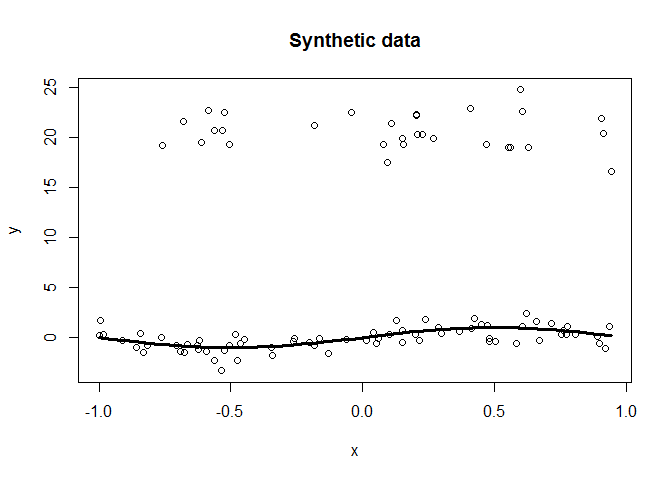
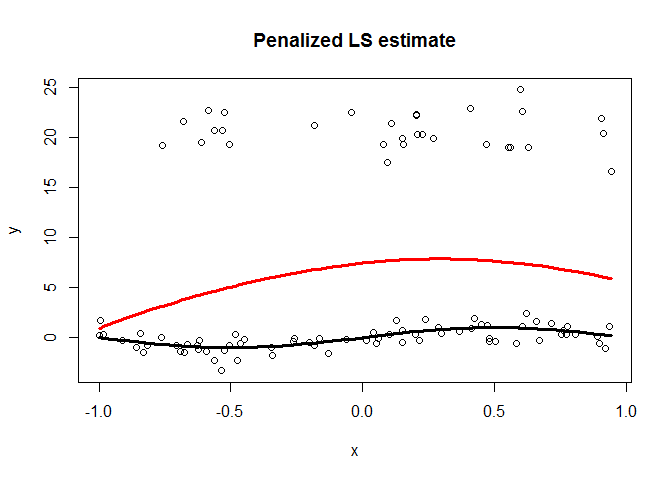

S-estimation for penalized regression splines
================
Matias Salibian
2016-08-31

S-estimators for penalized regression splines
---------------------------------------------

This repository contains code implementing the penalised S-regression estimators as proposed in "S-estimation for penalised regression splines" [Tharmaratnam et al (2010)](http://dx.doi.org/10.1198/jcgs.2010.08149).

All the necessary functions are in the file `pen-s-functions.R`. The following example illustrates how to use the code with a simple synthetic example and a cubic spline. I will soon also include the example we have in the paper.

First we read the necessary functions:

``` r
source("pen-s-functions.R")
```

Now we generate a synthetic sample of size `n = 100`. First generate a sample for the explanatory variable `x` and create the response `y = sin( pi * x ) + N(0, 0.7^2)`:

``` r
set.seed(17)
n <- 100  # sample size
x <- sort(runif(n, min = -1, max = 1))
muf <- sin(pi * x)
e <- rnorm(n, mean = 0, sd = 0.7)
y <- muf + e
```

We now add outliers. Each observation has a probability of 25% of being an outlier. Outlying responses follow a N(20, 4) distribution:

``` r
y0 <- 20
sd0 <- 2
p0 <- 0.25
index <- (1:n)[runif(n) < p0]
y[index] <- rnorm(length(index), y0, sd0)
```

A scatter plot of the data (with the true mean function overlaid) looks like this: 

We now create a vector of candidate values for the penalty parameter, the cubic spline design matrix, the penalty matrix (called D in the paper), and compute the LS estimator, selecting the amount of smoothing using GCV:

``` r
lambdas <- seq(0.1, 2, length = 100)
# build the design matrix
p <- 3
num.knots <- max(5, min(floor(length(unique(x))/4), 35))
knots <- quantile(unique(x), seq(0, 1, length = num.knots + 2))[-c(1, (num.knots + 
    2))]
xpoly <- rep(1, n)
for (j in 1:p) xpoly <- cbind(xpoly, x^j)
xspline <- outer(x, knots, "-")
xspline <- pmax(xspline, 0)^p
X <- cbind(xpoly, xspline)
# penalty matrix
D <- diag(c(rep(0, ncol(xpoly)), rep(1, ncol(xspline))))
# penalized LS fit (with GCV)
tmp.ls <- pen.ls.gcv(y, X, D, lambdas)
# add the penalized LS estimate to the plot
plot(x, y, main = "Penalized LS estimate")
lines(x, muf, lwd = 3, col = "black")
lines(x, tmp.ls$yhat, lwd = 3, col = "red")
```



We now compute the M- and S-estimators, where the amount of smoothing is chosen using a robust CV and robust GCV criterion, respectively.

``` r
NN <- 500  # max. no. of iterations for S-estimator
NNN <- 500  # no. of initial candidates for the S-estimator
cc <- 1.54764
b <- 0.5
# compute the penalized M with robust CV
tmp.m <- pen.m.rcv(y = y, X = X, N = NN, D = D, lambdas = lambdas, num.knots = num.knots, 
    p = p, epsilon = 1e-06)
# compute the penalized S-estimator (with robust GCV)
tmp.s <- pen.s.rgcv(y = y, X = X, D = D, lambdas = lambdas, num.knots = num.knots, 
    p = p, NN = NN, cc = cc, b = b, NNN = 50)
# add the penalized M- and S- estimates to the plot
plot(x, y, main = "Comparison of penalized regression estimators")
lines(x, muf, lwd = 3, col = "black")
lines(x, tmp.ls$yhat, lwd = 3, col = "red")
lines(x, tmp.m$yhat, lwd = 3, col = "green")
lines(x, tmp.s$yhat, lwd = 3, col = "blue")
legend(-0.75, 15, legend = c("LS", "M", "S", "True"), col = c("red", "green", 
    "blue", "black"), lwd = 3)
```


